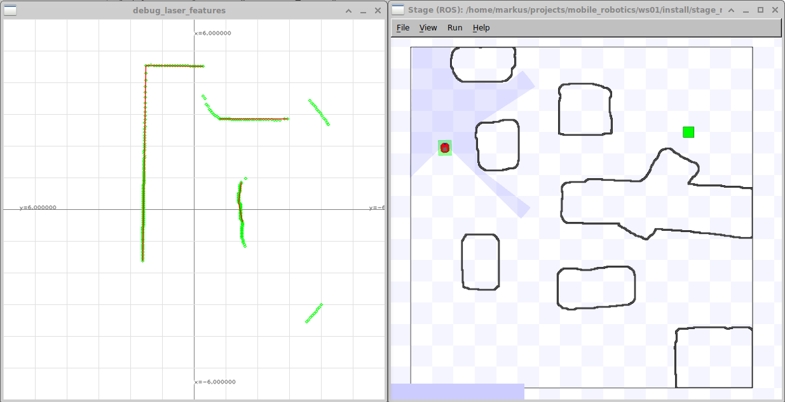

# tuw_laserscan_features
Feature extractor for laserscan message such as lines and line segments

## nodes
The package holds currently the following nodes

* linedetection 
* feature_viz
* composed_node

## linedetection
Line detection based on a divide and conquer algoritm.

* Input: `sensor_msgs/LaserScan`
* Output: `tuw_geometry_msgs/LineSegments` 
* Parameter: 
  * threshold_split_neighbor, bool, default: false
  * threshold_split, double, default: 0.05, split threshold [m]
  * min_length, double,  default: 0.1,  min line length [m]
  * min_points_per_line, int , default: 20, minimal number of points supporting a line
  * min_points_per_unit, int,  default: 10, minimal number of points supporting a unit

## feature_viz
It utilizes the tuw::figure class for a visualization

## composed_node
A demo which hows how to combine multiple nodes into one process. In this case the linedetection and feature_viz node are fused into one process.